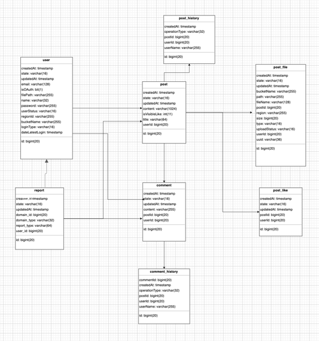

# 그릿지 테스트

- 구현 목록
    - [x] 유저
    - [x] 게시판

- 미완료 목록
    - [ ] 결제

## 서비스 링크

- http://43.200.122.153/v1/liveCheck
    - 해당 IP는 AWS EC2 서버의 Public IP입니다.
    - 해당 링크로 접속하면 서버가 정상적으로 동작하는지 확인할 수 있습니다.
    - Swagger를 통해 API 명세를 확인할 수 있습니다.
        - 접속 링크: [http://43.200.122.153/swagger-ui/index.html](http://43.200.122.153/swagger-ui/index.html)

## Structure

### ERD



### Folder Structure ✨

``` text
├── DemoApplication.java
├── common
│         ├── Constant.java
│         ├── Router.java
│         ├── cloud
│         │     └── storage
│         │             ├── config
│         │             └── service
│         │                 └── S3Service.java
│         ├── config
│         │         ├── AsyncConfig.java
│         │         ├── JpaConfig.java
│         │         ├── PropConfig.java
│         │         ├── RestTemplateConfig.java
│         │         ├── SchedulerConfig.java
│         │         ├── SwaggerConfig.java
│         │         └── WebConfig.java
│         ├── entity
│         │         └── BaseEntity.java
│         ├── exceptions
│         │         ├── BaseException.java
│         │         ├── ExceptionAdvice.java
│         │         └── NotFoundException.java
│         ├── model
│         │         ├── OperationType.java
│         │         └── response
│         │             ├── BaseResponse.java
│         │             ├── BaseResponseStatus.java
│         │             └── PageResponse.java
│         ├── oauth
│         │         ├── model
│         │         │         ├── OAuthToken.java
│         │         │         ├── Social.java
│         │         │         ├── SocialOauth.java
│         │         │         └── SocialUser.java
│         │         ├── provider
│         │         │         ├── GoogleOauth.java
│         │         │         ├── KakaoOauth.java
│         │         │         └── OAuthStrategy.java
│         │         └── service
│         │             └── OAuthService.java
│         ├── prop
│         │         ├── ApplicationProp.java
│         │         └── model
│         │             ├── Build.java
│         │             ├── PostFileBucket.java
│         │             ├── Storage.java
│         │             └── UserFileBucket.java
│         ├── scheduler
│         │         ├── CommentScheduleService.java
│         │         ├── PostScheduleService.java
│         │         └── UserScheduleService.java
│         └── secret
│             └── Secret.java
├── src
│         ├── admin
│         │         ├── controller
│         │         │         ├── AdminFeedController.java
│         │         │         ├── AdminHistoryController.java
│         │         │         ├── AdminReportController.java
│         │         │         └── AdminUserManageController.java
│         │         ├── model
│         │         │         ├── request
│         │         │         │         ├── AdminBlockReq.java
│         │         │         │         ├── AdminHistorySearchReq.java
│         │         │         │         ├── AdminPostSearchReq.java
│         │         │         │         ├── AdminUserSearchReq.java
│         │         │         │         └── adminReportSearchReq.java
│         │         │         └── response
│         │         │             ├── AdminCommentHistoryRes.java
│         │         │             ├── AdminPostDetail.java
│         │         │             ├── AdminPostHistoryRes.java
│         │         │             ├── AdminPostRes.java
│         │         │             ├── AdminReportRes.java
│         │         │             ├── AdminUserHistoryRes.java
│         │         │             └── AdminUserRes.java
│         │         └── service
│         │             ├── AdminFeedService.java
│         │             ├── AdminHistoryService.java
│         │             ├── AdminReportService.java
│         │             └── AdminUserManageService.java
│         ├── comment
│         │         ├── controller
│         │         │         └── CommentController.java
│         │         ├── entity
│         │         │         ├── Comment.java
│         │         │         └── view
│         │         │             └── CommentListView.java
│         │         ├── model
│         │         │         ├── request
│         │         │         │         ├── CommentCreateReq.java
│         │         │         │         ├── CommentDeleteReq.java
│         │         │         │         └── CommentUpdateReq.java
│         │         │         └── response
│         │         │             ├── CommentCreateRes.java
│         │         │             ├── CommentDetailRes.java
│         │         │             └── CommentUpdateRes.java
│         │         ├── repository
│         │         │         ├── CommentListViewRepository.java
│         │         │         └── CommentRepository.java
│         │         └── service
│         │             └── CommentService.java
│         ├── history
│         │         ├── entity
│         │         │         ├── CommentHistory.java
│         │         │         ├── PostHistory.java
│         │         │         └── UserHistory.java
│         │         ├── event
│         │         │         ├── CommentHistoryEvent.java
│         │         │         ├── PostHistoryEvent.java
│         │         │         └── UserHistoryEvent.java
│         │         ├── listener
│         │         │         ├── CommentHistoryListener.java
│         │         │         ├── PostHistoryListener.java
│         │         │         └── UserHistoryListener.java
│         │         └── repository
│         │             ├── CommentHistoryRepository.java
│         │             ├── CommentHistoryRepositoryCustom.java
│         │             ├── CommentHistoryRepositoryCustomImpl.java
│         │             ├── PostHistoryRepository.java
│         │             ├── PostHistoryRepositoryCustom.java
│         │             ├── PostHistoryRepositoryCustomImpl.java
│         │             ├── UserHistoryRepository.java
│         │             ├── UserHistoryRepositoryCustom.java
│         │             └── UserHistoryRepositoryCustomImpl.java
│         ├── post
│         │         ├── controller
│         │         │         └── PostController.java
│         │         ├── entity
│         │         │         ├── FileType.java
│         │         │         ├── Post.java
│         │         │         ├── PostFile.java
│         │         │         ├── PostLike.java
│         │         │         ├── UploadStatus.java
│         │         │         └── view
│         │         │             └── PostListView.java
│         │         ├── model
│         │         │         ├── request
│         │         │         │         ├── FileCreateReq.java
│         │         │         │         ├── FileDeleteReq.java
│         │         │         │         ├── PostCreateReq.java
│         │         │         │         ├── PostDeleteReq.java
│         │         │         │         ├── PostLikeReq.java
│         │         │         │         ├── PostUpdateReq.java
│         │         │         │         └── UploadStatusUpdateReq.java
│         │         │         └── response
│         │         │             ├── FileRes.java
│         │         │             ├── PostDetailRes.java
│         │         │             ├── PostLikeRes.java
│         │         │             └── PostSimpleRes.java
│         │         ├── repository
│         │         │         ├── PostFileRepository.java
│         │         │         ├── PostLikeRepository.java
│         │         │         ├── PostListViewRepository.java
│         │         │         ├── PostRepository.java
│         │         │         ├── PostRepositoryCustom.java
│         │         │         └── PostRepositoryCustomImpl.java
│         │         └── service
│         │             └── PostService.java
│         ├── report
│         │         ├── controller
│         │         │         └── ReportController.java
│         │         ├── entity
│         │         │         ├── DomainType.java
│         │         │         ├── Report.java
│         │         │         └── ReportType.java
│         │         ├── model
│         │         │         ├── request
│         │         │         │         └── ReportCreateReq.java
│         │         │         └── response
│         │         │             └── ReportRes.java
│         │         ├── repository
│         │         │         ├── ReportRepository.java
│         │         │         ├── ReportRepositoryCustom.java
│         │         │         └── ReportRepositoryCustomImpl.java
│         │         └── service
│         │             └── ReportService.java
│         ├── system
│         │         ├── controller
│         │         │         └── SystemController.java
│         │         └── model
│         │             └── data
│         │                 └── SystemInfoRes.java
│         └── user
│             ├── Service
│             │         └── UserService.java
│             ├── UserRes.java
│             ├── controller
│             │         └── UserController.java
│             ├── entity
│             │         ├── LoginType.java
│             │         ├── User.java
│             │         └── UserStatus.java
│             ├── model
│             │         ├── GetSocialOAuthRes.java
│             │         ├── GetUserRes.java
│             │         ├── PatchUserReq.java
│             │         ├── PostLoginReq.java
│             │         ├── PostLoginRes.java
│             │         ├── PostUserReq.java
│             │         └── PostUserRes.java
│             └── repository
│                 ├── UserRepository.java
│                 ├── UserRepositoryCustom.java
│                 └── UserRepositoryCustomImpl.java
└── utils
    ├── BeanUtil.java
    ├── JwtService.java
    ├── SHA256.java
    └── ValidationRegex.java

```

## 추가한 Library

- QueryDSL
    - 동적 쿼리를 손쉽게 짤 수 있게 해주는 JPA 보조 라이브러리 중 대중적인 라이브러리
- AWS S3 SDK
    - AWS S3에 파일을 업로드하고 다운로드하는 기능을 제공하는 SDK


 